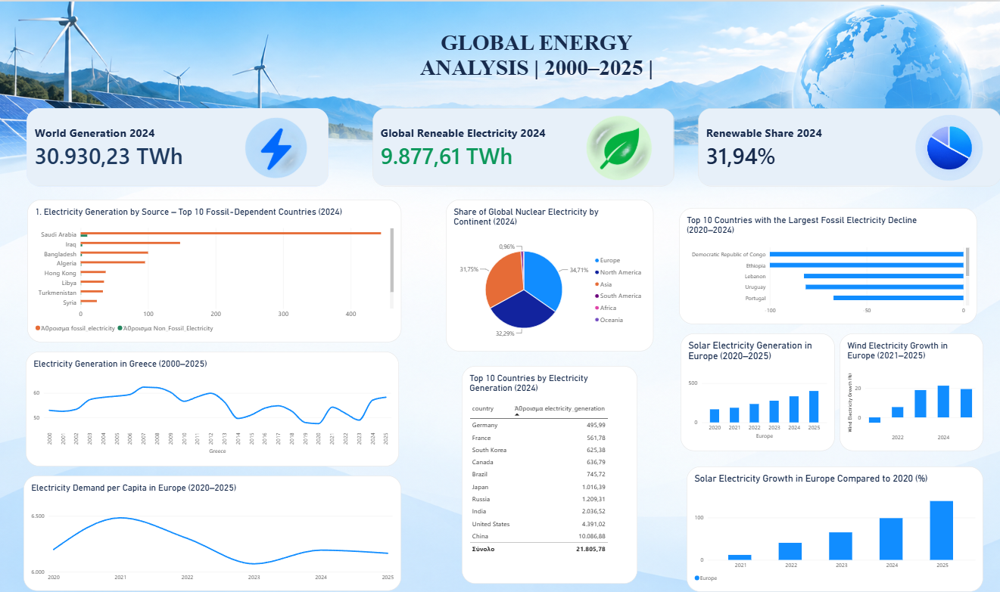

# Global Energy Data Analysis ⚡

An end-to-end data analysis project exploring global electricity generation, renewable energy, fossil fuel dependency, and energy trends from 2000 to 2025.

## 📊 Dashboard

## 🎯 Project Overview

The goal of this project was to analyze global energy data and identify trends in electricity generation, renewable energy, fossil fuels, nuclear energy, solar power, and wind power.

The project follows a complete data analysis workflow, from data cleaning to SQL analysis and interactive visualization.

## 🛠 Tools Used

- **Excel** – Data cleaning and preparation
- **SQL (MySQL)** – Data analysis and queries
- **Power BI** – Data visualization and dashboard creation

## 🔎 Analysis

The analysis includes:

- Global electricity generation
- Renewable electricity generation and share
- Fossil fuel dependency by country
- Countries with the largest decline in fossil electricity
- Nuclear electricity share by continent
- Electricity generation trends in Greece
- Electricity demand per capita in Europe
- Solar electricity generation and growth in Europe
- Wind electricity growth in Europe
- Top countries by electricity generation

## 💡 Key Insights

- Renewable electricity has shown significant growth in recent years.
- Solar and wind electricity generation in Europe increased substantially between 2020 and 2025.
- Fossil fuel dependency varies significantly between countries.
- A small number of countries account for a large share of global electricity generation.
- The energy mix differs considerably across continents.

## 📁 Repository Files

- `Energy_Analysis.sql` – SQL queries used for the analysis
- `Energy_Analysis.pbix` – Power BI dashboard file
- `energy_dashboard.png` – Final dashboard preview

## 📌 Skills Demonstrated

Data Cleaning • SQL • Data Analysis • Power BI • Data Visualization • Dashboard Design
